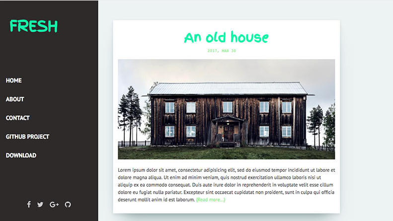
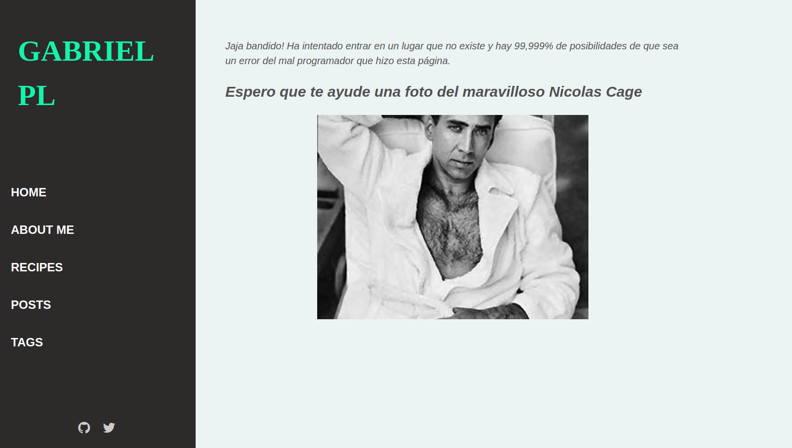

# Práctica: Jekyll

## Que son Jekyll y Liquid

Para esta práctica construiremos una página web personal usando jekyll, que es un generador de páginas estáticas. Para lo básico de jekyll se realizó el tutorial presente en la documentación oficial. El enlace es el siguiente: https://jekyllrb.com/docs/step-by-step/01-setup/  
El contenido de la página es bastante más avanzado que lo que se aborda en este tutorial pero sirve para un primer contacto con los conceptos más básicos.

## Características principales de la página

La página usa un directorio \_data para gestionar los enlaces de la sidebar de la izquierda de la página que sirve para navegar por el sitio web. La configuración del núcleo de la página se encuentra en \_config.yml, aquí indicamos por ejemplo el baseurl que usamos para cada despliegue, esto lo abordaremos mas adelante en el apartado de _baseurl y url_. También encontramos los defaults, que sirven para indicar el layout según el tipo, si post o collection por ejemplo. PAra los layouts se proporciona el directorio _layouts, que añade el layout de collections, aparte de los que vienen includos con el tema elegido. Procesamientos con Liquid se hacen varios, la mayoría se usan para iterar sobre elementos, como por ejemplo para los elementos de la sidebar. En el directorio _includes encontramos trozos de código que podemos reutilizar en cualquier layout. Por último, hacemos uso de las tags, para facilitar la organización de nuestro sitio web.

## Tema usado

Para la práctica se recomiendo usar Minimal Mistakes, pero para ñadir un toque de originalidad se ha usado Fresh, este es el estado original de la página si usamos este tema.



Tras haber instalado la plantilla, se cambiaron elementos como las redes sociales de la sidebar, o se añadió el layout para las collections.

## Despliegue e Github Pages

Para poder desplegar la página que no sea en local, se le debe especificar la baseurl que tendrá para que funcionen correctamente los assets. En el caso específico de github pages, publicará la página en al url baseurl: https://ull-esit-pl-2021.github.io", pero también tendrá una una baseurl con el nombre del repositorio, así que lo indicaremos en el apartado de baseurl: "/jekyll-github-pages-y-netlify-alu0101240374".

## Despliegue en Netlify

Para el despliegue en netlify son los mismos pasos que para github Pages(iniciar sesión, indicar un repositorio y elegir la rama), sin embargo, no hace falta poner una baseurl específica. Para arreglar este conflicto de fichero config separados, se crearon ramas para cada despliegue en específico, con sus baseurl correspondientes en los config.yml.

## Página 404

Si escribimos mal una dirección mientras navegamos, el servidor no sabrá como resolver esta situación y enviará un error al usuario. Para personalizar la experiencia del usuario existe una página original que indica que ha cometido un error e imprime una foto aleatoria de Nicolas Cage. Esto se hizo creando un html específico para el error 404 y añadiendo un contendero de tipo _script_. El código es el siguiente: 

```js
function randomFromInterval(min, max) {
   return Math.floor(Math.random() * (max - min + 1) + min);
 }
  let URL = '{{ page.cage.url }}' + `/${randomFromInterval(400,600)}/${randomFromInterval(400,600)}`;

  (async function() {
    try {
      
      let divTitle = document.getElementById("comment-cage");
      let divcage = document.getElementById("cage"); 
      let img = document.createElement("img");
      img.src = URL;
      let title = document.createElement("h2");
      title.innerText = "{{ page.cage.title }}";  
      divTitle.appendChild(title);
      divcage.appendChild(img);   

      const quoteDiv = document.getElementById("quote");
      const authorDiv = document.getElementById("author");
    }
    catch(e) { 
      console.log(e);
    }
  })();
```
La función de generar un número aleatorio es necesaria porque la API que se utiliza requiere de que escribas en la url dos número indicando el tamaño de la foto.
La página en cuestión sería la siguiente:  



## Html proofer

Existen herramientas para comprobar si nuestra página funciona. La que vamos a usar para esta práctica es HTML proofer. Esta herramienta comprueba que todas las imágenes y enlaces de nuestra página existen. Para usarla creamos un rakefile que ejecuta el programa si escribimos _rake test_. El script es el siguiente:

```rake
require 'html-proofer'
desc "test links in the build web site"
task :test do
  sh "bundle exec jekyll build"
  options = { 
    :assume_extension => true, 
    :disable_external => true, 
    :empty_alt_ignore => true,
    :file_ignore => [ %r{categories} ]
  }
  HTMLProofer.check_directory("./_site", options).run
end

```
También he añadido una action para que este test se dispare cuando hagamos un push.

```yml
name: CI
on:
  push:
    branches: [ master ]
jobs:
  build:
    runs-on: ubuntu-latest
    steps:
      - uses: actions/checkout@v2
      - uses: actions/setup-ruby@v1
        with:
          ruby-version: 2.7.x
      - run: bundle install
      - run: rake test
```
